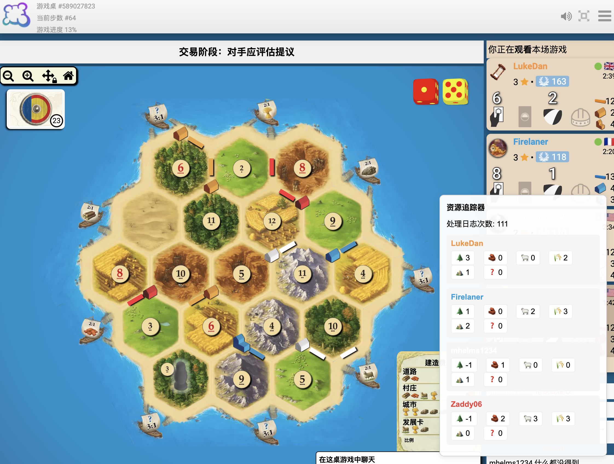

# Catan Resource Tracker Chrome 插件

这是一个用于 BoardGameArena 卡坦岛游戏的 Chrome 插件。插件会在页面右下角显示一个资源追踪器,实时展示所有玩家的资源情况。


## 功能特点

- 在页面右下角固定显示资源追踪器
- 实时监控游戏日志,自动更新玩家资源
- 支持追踪的资源类型:
  - 木材 🌲
  - 砖块 🧱
  - 羊毛 🐑
  - 麦子 🌾
  - 矿石 ⛰️
  - 未知资源 ❓
- 支持追踪的游戏行为:
  - 获得资源
  - 购买发展卡
  - 升级城市
  - 建造道路
  - 建造村庄
  - 银行交易
  - 玩家间交易
  - 资源弃置
  - 偷取资源
- 点击插件图标可以切换追踪器显示/隐藏
- 手动调整功能:
  - 隐藏自己的资源情况
  - 可以手动调整其他玩家的资源数量
  - 通过 +/- 按钮精确控制资源数量

## 安装方法

1. 下载本项目代码
2. 打开 Chrome 扩展程序页面 (chrome://extensions/)
3. 开启"开发者模式"
4. 点击"加载已解压的扩展程序"
5. 选择本项目文件夹

## 使用说明

1. 进入 BoardGameArena 的卡坦岛游戏页面
2. 资源追踪器会自动显示在右下角
3. 可以通过点击插件图标来切换显示/隐藏

## 项目结构
``` 
catan-resource-tracker/
├── manifest.json
├── background.js
├── content.js
└── styles.css 
``` 

## 已知问题和待办事项

### 功能完善
- [ ] 适配骑士扩展版本
- [ ] 优化未知资源(?)的追踪，完善偷卡行为的识别
- [ ] 添加多语言支持（目前仅支持中文）
- [ ] 添加资源统计图表
- [ ] 支持自定义显示位置
- [ ] 优化界面样式
- [ ] 50步以内似乎没问题，超过50步可能加载不出logs
- [ ] 如果没有偷到东西，bug。
- [ ] 建造村庄资源计算错误: Deanblake has -1 unknown resources left
- [ ] 偷取资源计算错误: AnimalMother83 has 0 unknown resources left
- [ ] 现在update判断gain之后，有bug
- [ ] 